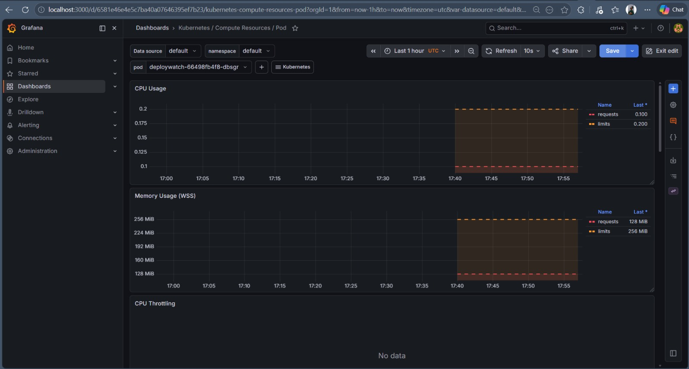
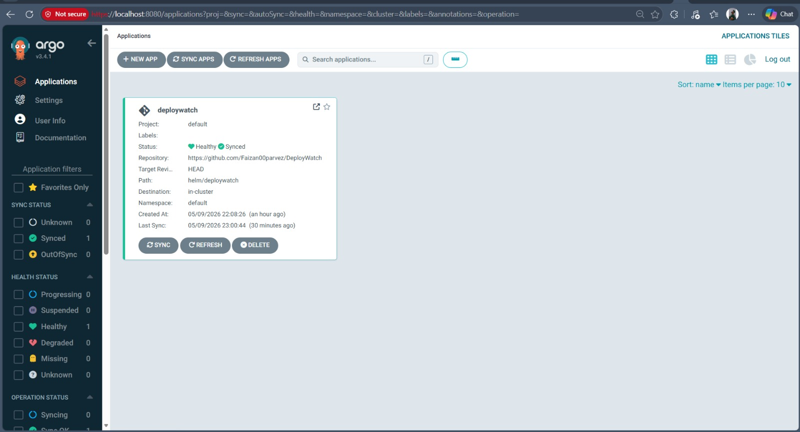
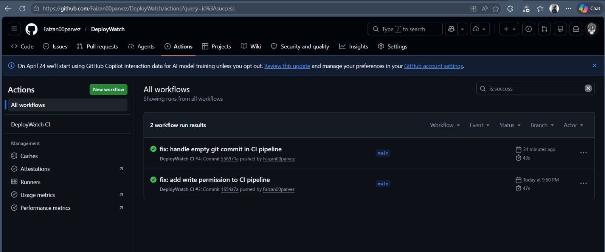

# DeployWatch 🚀

Automated deployment and monitoring system using Kubernetes, ArgoCD, Prometheus and Grafana.

> Push your code — DeployWatch handles the rest.

## 📸 Screenshots

### Grafana Monitoring Dashboard


### ArgoCD GitOps Deployment


### GitHub Actions CI Pipeline


## 🏗️ Architecture

Developer pushes code to GitHub
↓
GitHub Actions CI Pipeline
→ Runs tests
→ Builds Docker image
→ Pushes to Docker Hub
→ Updates Helm chart
↓
ArgoCD detects changes
→ Auto-deploys to Kubernetes
↓
Prometheus collects metrics
↓
Grafana displays live dashboard

## 🛠️ Tech Stack

| Tool | Purpose |
|---|---|
| Flask | Web application |
| Docker | Containerization |
| Kubernetes (Minikube) | Container orchestration |
| Helm | Kubernetes package manager |
| ArgoCD | GitOps continuous deployment |
| GitHub Actions | CI pipeline |
| Prometheus | Metrics collection |
| Grafana | Monitoring dashboard |

## 🚀 Getting Started

### Prerequisites
- Docker Desktop
- Minikube
- Helm
- kubectl

### Run Locally

```bash
# Clone the repo
git clone https://github.com/Faizan00parvez/DeployWatch.git
cd DeployWatch

# Start Minikube
minikube start

# Install ArgoCD
kubectl create namespace argocd
kubectl apply -n argocd -f https://raw.githubusercontent.com/argoproj/argo-cd/stable/manifests/install.yaml

# Apply ArgoCD application
kubectl apply -f argocd/application.yaml

# Install Prometheus + Grafana
kubectl create namespace monitoring
helm repo add prometheus-community https://prometheus-community.github.io/helm-charts
helm install prometheus prometheus-community/kube-prometheus-stack --namespace monitoring
```

## 📊 Monitoring

Access Grafana dashboard:
```bash
kubectl port-forward svc/prometheus-grafana -n monitoring 3000:80
```
Open: http://localhost:3000

Access ArgoCD dashboard:
```bash
kubectl port-forward svc/argocd-server -n argocd 8080:443
```
Open: https://localhost:8080

## 🔄 CI/CD Pipeline

1. Developer pushes code to `main` branch
2. GitHub Actions runs automated tests
3. Docker image built and pushed to Docker Hub
4. Helm chart updated with new image tag
5. ArgoCD detects change and auto-deploys

## 📁 Project Structure

DeployWatch/
├── app/                    # Flask application
│   ├── src/app.py          # Main application
│   └── tests/              # Pytest tests
├── helm/deploywatch/       # Helm chart
├── .github/workflows/      # GitHub Actions CI
├── argocd/                 # ArgoCD manifests
├── monitoring/             # Prometheus & Grafana configs
└── docs/images/            # Screenshots

