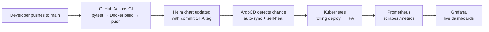

<div align="center">

# DeployWatch

[](https://github.com/Faizan00parvez/DeployWatch/actions/workflows/ci.yml)
[](LICENSE)
[](app/src/requirements.txt)
[](app/Dockerfile)
[](helm/deploywatch)

**Zero-touch deployments. Full observability.**

_Push your code — DeployWatch handles the rest._

[Features](#-features) · [Quickstart](#-quickstart) · [Architecture](#-architecture) · [API](#-api-reference) · [Screenshots](#-screenshots)

</div>

---

## What is DeployWatch?

DeployWatch is a complete GitOps deployment pipeline I built to answer one question: _what does it take to go from `git push` to a monitored production rollout with zero manual steps?_

Every push to `main` triggers automated tests, a versioned container build, and a GitOps sync that lands the new image on Kubernetes — with automatic rollback on failure and live CPU/memory observability throughout.

## ✨ Features

- **Fully automated CI/CD** — tests → Docker build → registry push → Helm chart update, on every push
- **GitOps with ArgoCD** — declarative deployments with automated sync, pruning, and self-healing
- **Live observability** — Prometheus metrics collection with Grafana dashboards
- **Self-healing workloads** — liveness/readiness probes plus HorizontalPodAutoscaler at 70% CPU
- **Status dashboard** — a built-in web UI showing pipeline health, version, and uptime in real time
- **Production-ready packaging** — multi-stage Docker builds, Helm chart, and versioned image tags per commit

## 🏗️ Architecture



## 🚀 Quickstart

### Prerequisites

- Docker Desktop
- Minikube
- Helm
- kubectl

### 1. Start the cluster and install ArgoCD

```bash
minikube start

kubectl create namespace argocd
kubectl apply -n argocd -f https://raw.githubusercontent.com/argoproj/argo-cd/stable/manifests/install.yaml

kubectl apply -f argocd/application.yaml
```

### 2. Install the monitoring stack

```bash
kubectl create namespace monitoring
helm repo add prometheus-community https://prometheus-community.github.io/helm-charts
helm install prometheus prometheus-community/kube-prometheus-stack --namespace monitoring
```

### 3. Push and watch it deploy

```bash
git push origin main
```

That's it. GitHub Actions builds and pushes the image, the Helm chart is updated with the new tag, and ArgoCD syncs it to the cluster automatically.

### Run the app locally (without Kubernetes)

```bash
cd app
python -m venv .venv && source .venv/bin/activate
pip install -r src/requirements.txt
python src/app.py
```

Open http://localhost:5000 for the dashboard.

## 📊 Monitoring

**Grafana dashboard:**

```bash
kubectl port-forward svc/prometheus-grafana -n monitoring 3000:80
```

Open http://localhost:3000

**ArgoCD dashboard:**

```bash
kubectl port-forward svc/argocd-server -n argocd 8080:443
```

Open https://localhost:8080

## 🔄 CI/CD Pipeline

| Stage | What happens | Tool |
|-------|--------------|------|
| Test | Pytest suite runs on every push/PR | GitHub Actions |
| Build | Multi-stage Docker build, tagged with commit SHA | Docker |
| Publish | Image pushed to Docker Hub (`:latest` + `:<sha>`) | Docker Hub |
| Update | Helm `values.yaml` updated with the new image tag | GitHub Actions |
| Deploy | ArgoCD auto-syncs the chart to Kubernetes | ArgoCD |
| Observe | Metrics scraped and visualized live | Prometheus + Grafana |

## 📡 API Reference

The app exposes a small JSON API alongside the dashboard:

| Method | Endpoint | Description |
|--------|----------|-------------|
| `GET` | `/` | Status dashboard (this UI) |
| `GET` | `/health` | Liveness/readiness probe |
| `GET` | `/info` | App metadata, version, uptime |
| `GET` | `/api/status` | Lightweight status payload (polled by the dashboard) |
| `GET` | `/metrics` | Prometheus metrics |

## 📸 Screenshots

### Grafana Monitoring Dashboard


### ArgoCD GitOps Deployment


### GitHub Actions CI Pipeline


## 📁 Project Structure

```
DeployWatch/
├── app/                    # Flask application + dashboard UI
│   ├── src/
│   │   ├── app.py          # App entrypoint (dashboard + JSON API)
│   │   ├── templates/      # Dashboard HTML
│   │   ├── static/         # CSS & JS
│   │   └── requirements.txt
│   ├── tests/              # Pytest suite
│   └── Dockerfile          # Multi-stage production build (gunicorn)
├── helm/deploywatch/       # Helm chart (deployment, service, HPA)
├── .github/workflows/      # CI: test → build → push → update chart
├── argocd/                 # ArgoCD Application manifest
├── monitoring/             # Prometheus & Grafana configs
└── docs/images/            # Screenshots
```

## 🛠️ Tech Stack

| Tool | Purpose |
|------|---------|
| Flask + Gunicorn | Web application & dashboard |
| Docker | Containerization |
| Kubernetes (Minikube) | Container orchestration |
| Helm | Kubernetes package manager |
| ArgoCD | GitOps continuous deployment |
| GitHub Actions | CI pipeline |
| Prometheus | Metrics collection |
| Grafana | Monitoring dashboards |

## 🤝 Contributing

This is a personal project, but suggestions and pull requests are welcome. If you spot a bug or have an idea, open an issue and I'll take a look.

## 📄 License

MIT — see [LICENSE](LICENSE) for details.

---

<div align="center">

Built by [Faizan Parvez](https://github.com/Faizan00parvez) · DevOps & Cloud Engineer

</div>
